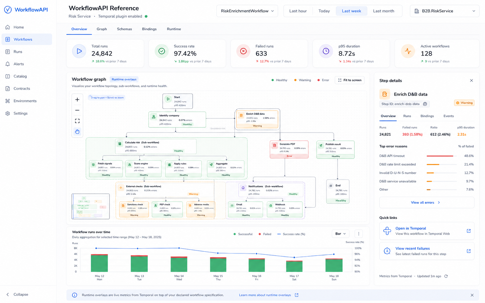
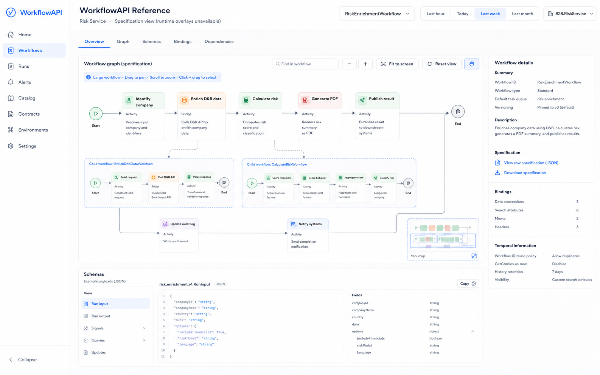
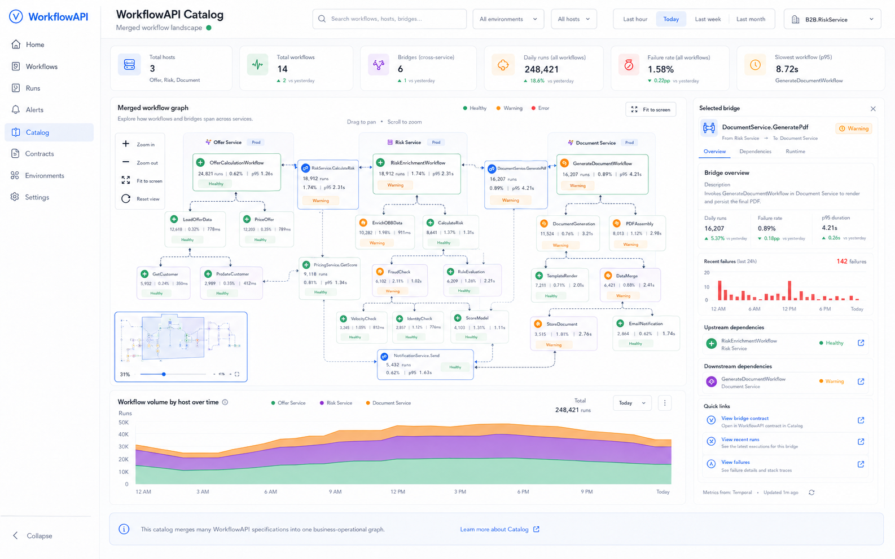
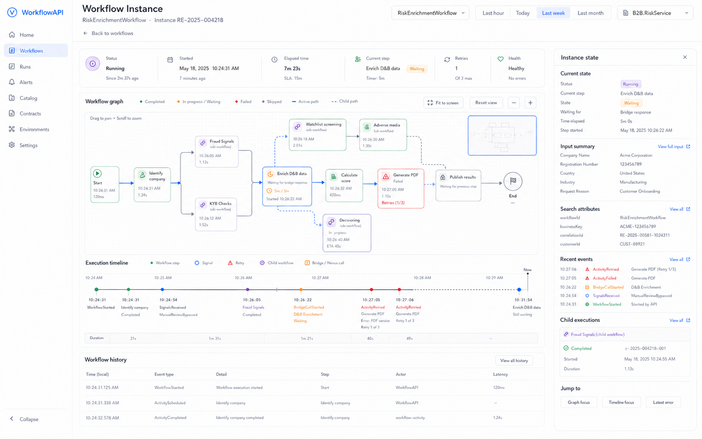

# WorkflowAPI

> **WorkflowAPI is a specification and tooling ecosystem for durable workflow APIs — analogous to OpenAPI for HTTP APIs and AsyncAPI for event/message APIs.**

WorkflowAPI describes long-running, stateful, externally interactable workflows: how they are started, what they accept and return, which signals, queries, updates, nested workflows, bridges, and runtime bindings they expose, and how those workflows are connected across an estate.

The first implementation target is **Temporal .NET**, with a generic WorkflowAPI document model, .NET generation packages, a single-service reference UI, a standalone catalog server, a Temporal runtime overlay plugin, and .NET Aspire hosting integration.

---

## Why WorkflowAPI?

Modern platforms increasingly expose important business capabilities as durable workflows rather than only HTTP endpoints or message topics:

- onboarding and fulfilment flows
- risk enrichment and approval workflows
- offer calculation and document generation
- billing, reconciliation, and dunning processes
- long-running background orchestration
- cross-namespace and cross-service workflow calls

OpenAPI describes synchronous HTTP APIs. AsyncAPI describes asynchronous message/event APIs. WorkflowAPI describes durable workflow APIs.

```text
OpenAPI      → HTTP APIs
AsyncAPI     → Event/message APIs
WorkflowAPI  → Durable workflow APIs
```

WorkflowAPI is intended to make workflow systems discoverable, documentable, visualizable, governable, and observable in a way that is useful to both engineering teams and business operations.

---

## Product vision

WorkflowAPI has two complementary UI modes:

1. **WorkflowAPI Reference** — a single-service UI similar in spirit to Scalar or Swagger UI, hosted by the workflow-owning application.
2. **WorkflowAPI Catalog** — a standalone catalog application that gathers many WorkflowAPI specs, merges them into a large cross-service graph, and optionally overlays runtime metrics.

Runtime-specific behaviour is provided by plugins. The first plugin is for Temporal.

```text
WorkflowAPI document
      ↓
Generic WorkflowAPI UI core
      ↓
Reference UI / Catalog UI
      ↓
Runtime overlay plugins
      ↓
Temporal metrics, execution state, errors, p95, deep links
```

---

## Mockups

The screenshots below are early product mockups. They show the intended direction for the UI, including large workflow graph support with zoom, pan, fit-to-screen, reset view, and minimap controls.

### Single-service reference view with Temporal runtime overlays



### Single-service specification view without runtime overlays



### Multi-service catalog view with merged workflows and bridges



### Workflow instance drill-down view



---

## Repository goals

This repository is the main monorepo for the WorkflowAPI project. It should contain:

- the WorkflowAPI specification and JSON Schema artifacts
- .NET packages for generating and serving WorkflowAPI documents
- Temporal .NET binding support
- a single-service reference UI
- a standalone multi-service catalog server
- runtime overlay plugin abstractions
- the Temporal runtime overlay plugin
- .NET Aspire hosting integration
- sample applications and conformance tests
- agentic implementation instructions and repository skills

---

## Proposed monorepo structure

```text
workflowapi/
  README.md
  LICENSE
  CONTRIBUTING.md
  CODE_OF_CONDUCT.md
  SECURITY.md
  AGENTS.md

  docs/
    specification/
      workflowapi.md
      temporal-binding.md
      bridges.md
      catalog.md
      runtime-overlays.md
      validation.md
      versioning.md
      security.md
    adr/
      0001-workflowapi-name.md
      0002-monorepo-first.md
      0003-temporal-first-binding.md
    assets/
      screenshots/
        workflowapi-reference-runtime-overlays.png
        workflowapi-reference-specification-view.png
        workflowapi-catalog-merged-runtime.png
        workflowapi-instance-drilldown.png

  schemas/
    workflowapi.schema.json
    workflowapi-temporal-binding.schema.json
    workflowapi-runtime-overlay.schema.json

  src/
    dotnet/
      WorkflowApi.Abstractions/
      WorkflowApi.AspNetCore/
      WorkflowApi.Temporal/
      WorkflowApi.Reference/
      WorkflowApi.Cli/
      WorkflowApi.MSBuild/
      WorkflowApi.Catalog.Server/
      Aspire.Hosting.WorkflowApiCatalog/

    web/
      workflowapi-ui-core/
      workflowapi-reference-ui/
      workflowapi-catalog-ui/
      workflowapi-temporal-overlay/

  examples/
    risk-enrichment.workflowapi.yaml
    document-service-generate-pdf.bridge.workflowapi.yaml

  samples/
    temporal-risk-service/
      Risk.Workflows/
      Risk.Api/
      Risk.Worker/
      Risk.AppHost/

    temporal-multi-service-catalog/
      Offer.Workflows/
      Risk.Workflows/
      Document.Workflows/
      AppHost/

  tests/
    dotnet/
    schema/
    conformance/
    integration/

  eng/
    build/
    scripts/
    pipelines/

  .agents/
    skills/
      workflowapi-spec/
      dotnet-sdk/
      temporal-binding/
      ui-catalog/
      aspire-hosting/
      conformance/

  .github/
    workflows/
    instructions/
    prompts/
    copilot-instructions.md
```

---

## Core concepts

### WorkflowAPI document

A WorkflowAPI document describes one or more durable workflow APIs and their runtime-neutral contract surface.

It should cover:

- workflows
- run/start operation
- signals
- queries
- updates
- steps
- edges
- nested workflows
- child workflows
- reusable subflows
- bridges
- external dependencies
- schemas
- examples
- security metadata
- runtime bindings

### Workflow host

A **workflow host** is an application that hosts workflow capabilities. In Temporal, this is usually a worker process, but it can also be a combined API + background worker application.

A WorkflowAPI document may be served by:

- a dedicated worker
- a combined API and worker
- a background service
- a monolith
- a standalone catalog server
- a build/CI artifact pipeline

### Bridge

A **bridge** is a generic cross-boundary workflow connection. Temporal Nexus is the first concrete bridge binding.

Examples:

```text
OfferCalculationWorkflow
  → bridge RiskService.CalculateRisk
  → RiskEnrichmentWorkflow

RiskEnrichmentWorkflow
  → bridge DocumentService.GeneratePdf
  → GenerateDocumentWorkflow
```

### Runtime overlay

A runtime overlay decorates a declared WorkflowAPI graph with runtime metrics and execution information.

The graph comes from the specification. The overlay comes from a runtime plugin.

For Temporal, runtime overlays may include:

- workflow run counts
- completed, failed, timed out, terminated, and running counts
- p50, p95, and p99 duration
- activity error rates
- retry counts
- bridge/Nexus operation health
- recent failures
- workflow instance state
- links to Temporal Web

### Example WorkflowAPI YAML

The repository includes two starter YAML examples:

- [`examples/risk-enrichment.workflowapi.yaml`](examples/risk-enrichment.workflowapi.yaml) — a workflow document with nested child workflows, reusable subflows, activities, signals, queries, updates, and bridge references.
- [`examples/document-service-generate-pdf.bridge.workflowapi.yaml`](examples/document-service-generate-pdf.bridge.workflowapi.yaml) — a separately owned bridge contract, including a generic bridge and a Temporal Nexus binding.

A shortened workflow example looks like this:

```yaml
workflowApi: 0.1.0
info:
  title: Risk Service Workflow API
  version: 1.0.0

host:
  id: risk-service
  name: Risk Service

bindings:
  temporal:
    namespace: B2B.RiskService
    taskQueue: risk-enrichment

workflows:
  RiskEnrichmentWorkflow:
    displayName: Risk enrichment workflow
    run:
      operationId: runRiskEnrichment
      input:
        $ref: '#/components/schemas/RiskEnrichmentRequest'
      output:
        $ref: '#/components/schemas/RiskEnrichmentResult'
    signals:
      ManualReviewBypassed:
        input:
          $ref: '#/components/schemas/ManualReviewBypassedSignal'
    queries:
      GetStatus:
        output:
          $ref: '#/components/schemas/RiskEnrichmentStatus'
    topology:
      nodes:
        start:
          kind: start
        identify-company:
          kind: activity
          activityRef: IdentifyCompanyActivity
        enrich-dnb-data:
          kind: bridge
          bridgeRef: bridges.Dnb.EnrichCompany
        calculate-risk:
          kind: childWorkflow
          workflowRef: CalculateRiskWorkflow
        document-pdf:
          kind: bridge
          bridgeRef: bridges.DocumentService.GeneratePdf
        end:
          kind: end
      edges:
        - from: start
          to: identify-company
        - from: identify-company
          to: enrich-dnb-data
        - from: enrich-dnb-data
          to: calculate-risk
        - from: calculate-risk
          to: document-pdf
        - from: document-pdf
          to: end

  CalculateRiskWorkflow:
    displayName: Calculate risk child workflow
    visibility: internal
    parentWorkflows:
      - RiskEnrichmentWorkflow
    run:
      operationId: runCalculateRisk
      input:
        $ref: '#/components/schemas/CalculateRiskRequest'
      output:
        $ref: '#/components/schemas/RiskScoreResult'
    topology:
      nodes:
        start:
          kind: start
        fetch-signals:
          kind: subflow
          subflowRef: '#/components/subflows/SignalCollectionSubflow'
        external-checks:
          kind: childWorkflow
          workflowRef: ExternalChecksWorkflow
        end:
          kind: end
      edges:
        - from: start
          to: fetch-signals
        - from: fetch-signals
          to: external-checks
        - from: external-checks
          to: end

components:
  subflows:
    SignalCollectionSubflow:
      summary: Reusable inline subflow for collecting scoring signals.
      nodes:
        fetch-payment-history:
          kind: activity
          activityRef: FetchPaymentHistoryActivity
        normalise-signals:
          kind: activity
          activityRef: NormaliseRiskSignalsActivity
      edges:
        - from: fetch-payment-history
          to: normalise-signals
```

A shortened separate bridge example looks like this:

```yaml
workflowApi: 0.1.0
info:
  title: Document Service Bridge Contract
  version: 1.0.0

host:
  id: document-service
  name: Document Service

bridges:
  DocumentService.GeneratePdf:
    displayName: Generate risk summary PDF
    kind: workflowBridge
    direction: requestReply
    input:
      $ref: '#/components/schemas/GeneratePdfRequest'
    output:
      $ref: '#/components/schemas/GeneratePdfResult'
    target:
      workflowRef: GenerateDocumentWorkflow
      operationId: runGenerateDocument
    binding:
      temporal:
        bridgeType: nexus
        endpoint: document-service-nexus
        service: DocumentService
        operation: GeneratePdf
        targetNamespace: B2B.DocumentService
        targetTaskQueue: document-generation
        callerNamespaces:
          - B2B.RiskService
          - B2B.OfferService
```

---

## .NET developer experience

The .NET implementation should follow the current ASP.NET Core OpenAPI pattern: document generation is separate from UI rendering.

A single workflow host should be able to expose its own WorkflowAPI document and reference UI:

```csharp
var builder = WebApplication.CreateBuilder(args);

builder.Services.AddWorkflowApi("v1")
    .ScanFromAssemblyOf<RiskEnrichmentWorkflow>()
    .WithTemporal(options =>
    {
        options.Namespace = builder.Configuration["Temporal:Namespace"];
        options.TaskQueue = "risk-service";
    });

var app = builder.Build();

app.MapWorkflowApi();
app.MapWorkflowApiReference();

app.Run();
```

The default endpoints should be convention-based:

```text
GET /workflow-api/v1.json
GET /.well-known/workflow-api.json
GET /workflow-api
```

The API should be intentionally similar to modern .NET OpenAPI usage:

```csharp
builder.Services.AddOpenApi();
app.MapOpenApi();
app.MapScalarApiReference();
```

WorkflowAPI equivalent:

```csharp
builder.Services.AddWorkflowApi();
app.MapWorkflowApi();
app.MapWorkflowApiReference();
```

---

## Temporal .NET binding

Temporal .NET is the first binding target.

WorkflowAPI should infer as much as possible from Temporal SDK attributes and method signatures, then enrich the document using WorkflowAPI-specific attributes, XML comments, Scrutor-based discovery, options, and transformers.

Expected inference sources:

- `[Workflow]`
- `[WorkflowRun]`
- `[WorkflowSignal]`
- `[WorkflowQuery]`
- `[WorkflowUpdate]`
- `[Activity]`
- method input/output types
- XML documentation comments
- explicit WorkflowAPI attributes
- Temporal host options
- worker registration metadata where available

Temporal runtime binding metadata includes:

- namespace
- task queue
- workflow type
- activity type
- search attributes
- retry policy
- workflow ID reuse policy
- continue-as-new policy
- memo and headers
- Temporal Web URL
- Nexus endpoints/services/operations where applicable

---

## Standalone catalog server

The standalone catalog server is a normal .NET application. It does not need to host workflows itself.

It can be configured with a list of WorkflowAPI source endpoints, similar to the old HealthChecks UI style of configuring monitored endpoints.

Example configuration:

```json
{
  "WorkflowApiCatalog": {
    "Sources": [
      {
        "Name": "Risk Service",
        "Uri": "http://risk-service/.well-known/workflow-api.json"
      },
      {
        "Name": "Offer Service",
        "Uri": "http://offer-service/.well-known/workflow-api.json"
      },
      {
        "Name": "Document Service",
        "Uri": "http://document-service/.well-known/workflow-api.json"
      }
    ],
    "RefreshInterval": "00:01:00",
    "CacheMode": "Memory"
  },
  "RuntimeOverlays": {
    "Temporal": {
      "Enabled": true,
      "Address": "temporal-frontend:7233",
      "Namespace": "B2B.RiskService",
      "WebUrl": "http://temporal-ui:8233"
    }
  }
}
```

At startup, the catalog should:

1. read configured sources
2. fetch WorkflowAPI documents
3. validate them
4. cache them in memory
5. merge them into a catalog graph
6. expose the catalog UI
7. optionally start a background refresh loop
8. optionally enable runtime overlays if credentials/config are present

---

## Aspire integration

The standalone catalog should be usable from Aspire as a custom hosting extension.

Example:

```csharp
var temporal = builder.AddTemporalServer("temporal");

var riskWorker = builder.AddProject<Projects.Risk_Worker>("risk-worker")
    .WithReference(temporal);

var offerWorker = builder.AddProject<Projects.Offer_Worker>("offer-worker")
    .WithReference(temporal);

var documentWorker = builder.AddProject<Projects.Document_Worker>("document-worker")
    .WithReference(temporal);

builder.AddWorkflowApiCatalog("workflowapi-catalog")
    .WithCatalogSource(riskWorker)
    .WithCatalogSource(offerWorker)
    .WithCatalogSource(documentWorker)
    .WithTemporalOverlay(temporal, namespaceName: "default")
    .WithExternalHttpEndpoints();
```

By convention, `.WithCatalogSource(project)` should look for:

```text
/.well-known/workflow-api.json
```

Overloads should allow explicit endpoint paths when necessary.

---

## Package plan

### NuGet packages

```text
WorkflowApi.Abstractions
WorkflowApi.AspNetCore
WorkflowApi.Temporal
WorkflowApi.Reference
WorkflowApi.Cli
WorkflowApi.MSBuild
WorkflowApi.Catalog.Server
WorkflowApi.Catalog.Client
WorkflowApi.Runtime.Abstractions
WorkflowApi.Runtime.Temporal
Aspire.Hosting.WorkflowApiCatalog
```

### Web packages

```text
@workflowapi/ui-core
@workflowapi/reference-ui
@workflowapi/catalog-ui
@workflowapi/temporal-overlay
@workflowapi/visualiser-adapter
```

### Container images

```text
ghcr.io/WorkflowApi/workflowapi-catalog
```

---

## Tooling

WorkflowAPI should include CLI and MSBuild tooling.

Example CLI commands:

```bash
workflowapi validate ./workflow-api.json
workflowapi export --assembly ./Risk.Workflows.dll --output ./workflow-api.json
workflowapi diff ./old.json ./new.json
workflowapi bundle ./specs --output ./catalog-bundle.json
workflowapi publish ./workflow-api.json --catalog https://workflowapi.example.internal
```

MSBuild integration should support CI artifact generation:

```xml
<PropertyGroup>
  <WorkflowApiGenerateOnBuild>true</WorkflowApiGenerateOnBuild>
  <WorkflowApiDocumentName>v1</WorkflowApiDocumentName>
  <WorkflowApiOutputPath>$(BaseIntermediateOutputPath)workflow-api/</WorkflowApiOutputPath>
</PropertyGroup>
```

---

## Validation and conformance

WorkflowAPI needs conformance levels:

- **Document validation** — JSON Schema validation
- **Semantic validation** — references, graph integrity, binding correctness
- **Binding validation** — Temporal-specific checks
- **Catalog validation** — merge/collation conflict rules
- **Runtime overlay validation** — metric/document identity alignment

Validation examples:

```text
Unknown step referenced by edge                  → error
Bridge references unknown operation             → error
Workflow has no run operation                    → error
Step declared but disconnected                   → warning
Temporal binding has task queue but no namespace → warning/error depending on mode
Duplicate workflow identity in merged catalog    → diagnostic
```

---

## Roadmap

### Phase 0 — Specification foundation

- WorkflowAPI document model
- JSON Schema
- Temporal binding model
- examples
- validation rules
- ADRs

### Phase 1 — .NET generator and reference UI

- `WorkflowApi.Abstractions`
- `WorkflowApi.AspNetCore`
- Scrutor-based scanning
- XML docs support
- `MapWorkflowApi()`
- `MapWorkflowApiReference()`
- static single-service UI

### Phase 2 — Temporal binding

- Temporal SDK attribute inference
- Temporal binding metadata
- Temporal examples
- runtime overlay abstractions

### Phase 3 — Catalog server

- standalone .NET catalog app
- configured source list
- memory cache
- source refresh
- multi-spec collation
- merged graph UI

### Phase 4 — Runtime overlays

- Temporal runtime overlay provider
- execution counts
- time-range metrics
- instance drill-down
- Temporal Web deep links

### Phase 5 — Aspire and Kubernetes

- catalog Docker image
- Aspire hosting extension
- local multi-service sample
- Kubernetes deployment manifests/Helm chart

---

## Non-goals for v1

WorkflowAPI is not intended to be:

- a workflow engine
- a BPMN replacement
- a low-code designer
- a Temporal UI replacement
- a process-mining engine
- a write/control plane for Temporal
- an execution debugger

v1 should focus on specification generation, reference documentation, catalog collation, and read-only runtime overlays.

---

## Project status

WorkflowAPI is currently in early design/prototype stage.

The immediate goal is to establish the monorepo, formalize the specification, build the .NET generator and reference UI, and produce a Temporal .NET sample that can act as the first conformance fixture.

---

## Contributing

Contributions will be welcome once the initial repository structure and governance files are in place.

Expected contribution areas:

- WorkflowAPI specification design
- .NET generation and ASP.NET Core integration
- Temporal binding support
- UI and graph visualization
- runtime overlay providers
- examples and conformance tests
- Aspire hosting integration
- documentation and adoption guides

---

## License

License to be decided. Recommended initial options:

- Apache-2.0 for broad enterprise adoption
- MIT for simplicity

The project should choose and document the license before accepting outside contributions.
